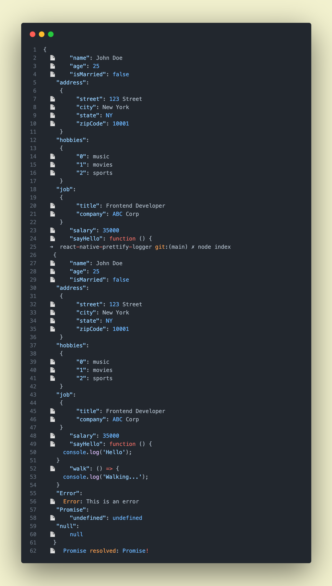

---

# 📚 Global Logger for React Native

---

## 🎯 Overview

This library provides a global logger for React Native applications. The logger enhances console output with colors and emojis, significantly improving readability and making debugging easier. It supports various types including primitive types, objects, promises, and errors.

Additionally, the library provides functionality to log HTTP requests and responses made with Fetch or Axios, as well as local storage actions.


## ⚙️ Installation

To use this library in your React Native project, just copy the logger code into your main JavaScript file (typically `App.js` or `index.js`).

Then, assign the logger function and additional features to the global object:

```javascript
import logger, { startLoggingRequests, stopLoggingRequests, logRequestsWithFilter, logLocalStorage, fetchWithLogging, axiosInstance } from 'react-native-prettify-logger';

global.logger = logger;
global.startLoggingRequests = startLoggingRequests;
global.stopLoggingRequests = stopLoggingRequests;
global.logRequestsWithFilter = logRequestsWithFilter;
global.logLocalStorage = logLocalStorage;
global.fetch = fetchWithLogging;
global.axios = axiosInstance;
```

## 🚀 Usage

Once the logger is installed, you can call it from anywhere in your application using `global.logger(...)`. The logger can take any number of arguments and will log them out to the console. It also identifies and appropriately handles different types of values including promises, errors, and objects.

```javascript
global.logger('Hello, world!', 123, { key: 'value' }, new Error('An error occurred!'), Promise.resolve('Promise result!'));
```

### Logging HTTP Requests and Responses

You can enable logging of all HTTP requests and responses made with Fetch or Axios in your application by calling `startLoggingRequests()`. To stop logging, call `stopLoggingRequests()`. If you want to log only certain requests, you can pass a filter function to `logRequestsWithFilter(filterFunc)`, where `filterFunc` is a function that takes a URL and returns `true` if the request should be logged, and `false` otherwise.

```javascript
// Log all requests
global.startLoggingRequests();

// Log only requests to 'api.example.com'
global.logRequestsWithFilter(url => url.includes('api.example.com'));

// Stop logging requests
global.stopLoggingRequests();
```

### Logging Local Storage Actions

You can log actions performed on the local storage by calling `logLocalStorage()`. The function logs the current state of the local storage.

```javascript
global.logLocalStorage();
```

### Example 
```javascript
//dummy data to check the logger
const dummyData = {
  name: 'John Doe',
  age: 25,
  isMarried: false,
  address: {
    street: '123 Street',
    city: 'New York',
    state: 'NY',
    zipCode: 10001,
  },
  hobbies: ['music', 'movies', 'sports'],
  job: {
    title: 'Frontend Developer',
    company: 'ABC Corp',
  },
  salary: 35000,
  sayHello: function () {
    console.log('Hello');
  },
  walk: () => {
    console.log('Walking...');
  },
  Error: new Error('This is an error'),
  Promise: Promise.resolve('Promise!'),
  undefined: undefined,
  null: null,
};

global.logger(dummyData);
```



### Features

- **String Logging**: Strings are logged with a green color and a 📄 emoji.
- **Number Logging**: Numbers are logged with a green color and a 🔢 emoji.
- **Boolean Logging**:

 Booleans are logged with a green color (for true) or orange (for false), and a ✅ emoji.
- **Object Logging**: Objects are pretty-printed with colored keys and values. Each key-value pair is logged on its own line. A 📦 emoji is used.
- **Array Logging**: Arrays are logged as objects, with indices as keys. A 📚 emoji is used.
- **Error Logging**: Errors are logged with a red color, along with the error message. A ❌ emoji is used.
- **Undefined Logging**: Undefined values are logged with a red color and a ❓ emoji.
- **Null Logging**: Null values are logged with a red color and a 🈳 emoji.
- **Function Logging**: Functions are logged with a green color and a 🔧 emoji.
- **Promise Logging**: Promises are logged with a green color if they resolve, or a red color if they reject. A 🤝 emoji is used.
- **HTTP Request and Response Logging**: HTTP requests and responses made with Fetch or Axios are logged with relevant details.
- **Local Storage Logging**: Local storage actions are logged with the current state of the local storage.

### Customizing the Logger

The logger can be customized by modifying the `colors` and `emojis` objects in the code.

## 🔮 Future Enhancements

- Configurable color schemes.
- Support for custom emojis and icons.
- Output to log files in addition to the console.

## 📄 License

This project is licensed under the MIT License.

## 🙋‍♂️ Contributing

We welcome contributions to improve this library. Please open an issue or submit a pull request on our GitHub repository.

## 👏 Acknowledgements

Thank you to all contributors and users of this library.

---

Remember to replace "MIT License" with the actual license your project is under, and add any other sections you feel are necessary. This is just a template and should be customized to your needs.
